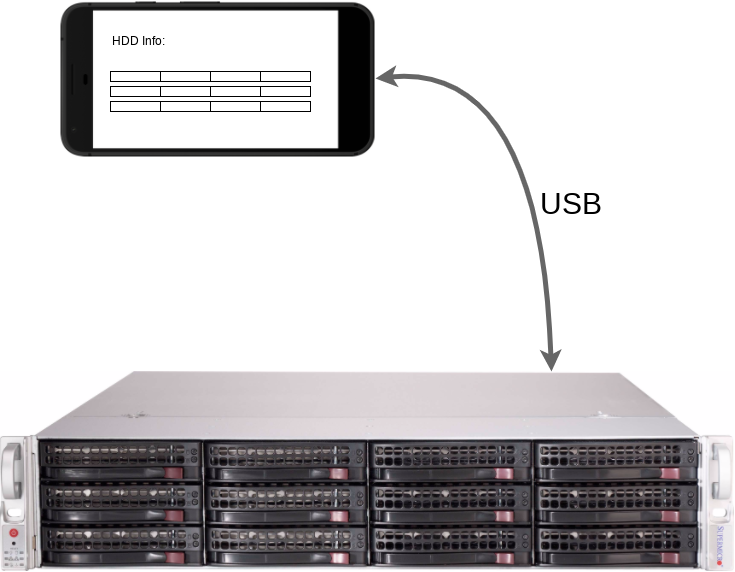

# udev-infopanel

Cílem projektu je vytvořit jednoduchý a levný infopanel k linuxovému storage serveru, ve kterém dochází k časté obměně pevných disků. 
Může se tak dít např. v zálohovacím serveru, kde se backup disky v tomto serveru střídají, podobně jako při zálohování na magnetické pásky.

Infopanel má zobrazovat informaci o přítomnosti disků v jednotlivých šachtách serveru. A dále jejich identifikaci např. výrobním číslem či jménem.
Nejvíce důležitou informací je, zda je disk v aktivním stavu - nelze jej tedy jen tak vyjmout a je třeba počakt, až bude odpojen/vypnut.

Typ zobrazovaných informací:
* Přítomnost "running" disku v šachtě
* Výrobní číslo disku
* Jméno disku dle tabulky (SN / name)

## Princip funkce



### Informační displej
* libovolný vyřazený Android / iOS telefon připojený USB kabelem k serveru.
* Telefon je třeba přepnout do režimu "USB Tethering", tzn. že telefon a server se tváří, jako kdyby byli propojeni ethernetovým kabelem. Na telefonu běží DHCP server.
* V nastavení telefonu je třeba vypnout vypínání displeje, pokud je telefon v nabíječce (Android - Nastavení - Vývojářské možnosti - Zůstat vzhůru)

### Server
* získá IP adresu pro usb ethernet z DHCP serveru telefonu 
* běží zde web server s informacemi o discích
* web server dostává informace o událostech připojení/odpojení disku z udev rules

## Instalace
Potřebné balíky:
* apache2
* libapache2-mod-php
* php5
* php-cli

```Bash
cd /var/www/
git clone https://github.com/lukaskaplan/udev-infopanel
cd ./udev-infopannel
chmod a+x ./install.sh
./install.sh
```

## Poznamky k udev
https://wiki.debian.org/udev

**Cesty k udev rules**
* /etc/udev/rules.d/
* /lib/udev/rules.d/
* /run/udev/rules.d/

**Příklad udev rules souboru:**
```
SUBSYSTEMS=="scsi",ATTRS{model}=="WDC WD1600AAJS-6",ATTRS{state}=="running", ENV{"ID_SERIAL_SHORT"}="WD-WCAV36680606"
```

**Užitečné příkazy**
* udevadm control --reload-rules
* udevadm info --name=sdc -q all
* udevadm info --name=sdc --attribute-walk
* udevadm monitor --property


* hdparm -C /dev/sdk
* hdparm -y /dev/sdk (zastavení disku)
* echo offline > /sys/block/sdk/device/state (odpojení disku)
* cat /sys/block/sdk/device/state
